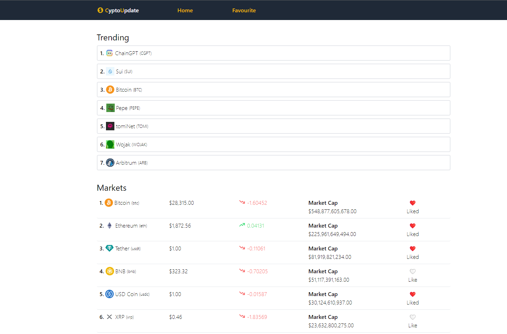
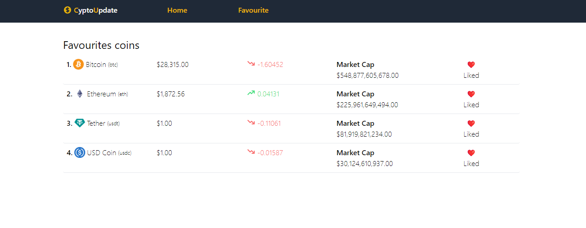
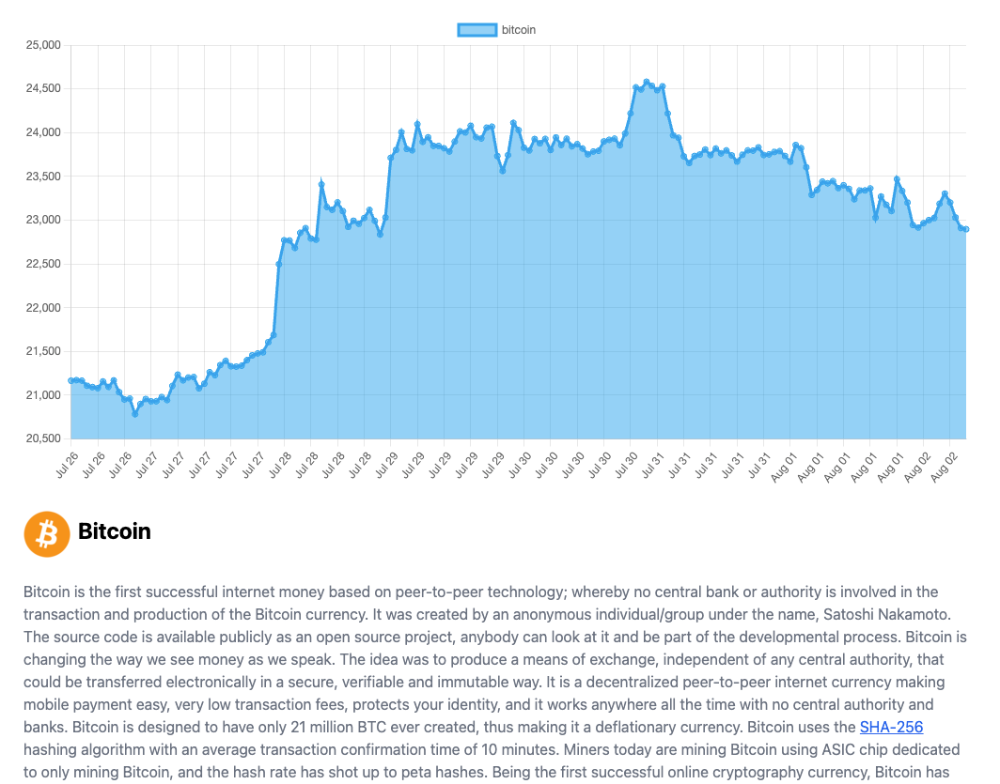

Autorzy: Cezary Śliwiński 12549, Grzegorz Pakuła 13889, Grzegorz Śliwiński 12550, Mateusz Szczepanek 13924
==========================================================================================================

Wstęp
=====

Nasza aplikacja to narzędzie, które umożliwia przeglądanie aktualnych
kursów kryptowalut z różnych źródeł dzięki API od Coingecko. Dzięki
wykorzystaniu React i ViteJS, nasza aplikacja działa szybko i płynnie,
oferując użytkownikom łatwe i intuicyjne sposoby przeglądania i
śledzenia kursów swoich ulubionych kryptowalut. Aby zapewnić atrakcyjny
wygląd i funkcjonalność interfejsu użytkownika, korzystamy z bibliotek
takich jak Tailwind CSS, React-Chartjs-2, React-router-dom, HeroIcons
oraz MomentJS. Wszystkie te biblioteki pozwalają na tworzenie
interaktywnych i przyjaznych dla użytkownika aplikacji, która spełni
oczekiwania nawet najbardziej wymagających użytkowników. Dzięki
możliwości dodawania ulubionych kryptowalut, nasza aplikacja daje
użytkownikom pełną kontrolę nad tym, jakie informacje są dla nich
najważniejsze, co pozwala im szybko i łatwo przeglądać aktualne kursy i
śledzić zmiany na rynku kryptowalut.

Instalacja
==========

Aby zainstalować aplikację, należy postępować zgodnie z poniższymi
instrukcjami:

1.  Pobierz kod źródłowy aplikacji z repozytorium na GitHubie.

2.  Zainstaluj środowisko Node.js na swoim komputerze. Można to zrobić
    poprzez pobranie i zainstalowanie wersji odpowiedniej dla Twojego
    systemu operacyjnego ze strony
    [*https://nodejs.org/en/download/*](https://nodejs.org/en/download/).

3.  Otwórz terminal lub wiersz polecenia i przejdź do folderu, w którym
    znajduje się pobrany kod źródłowy aplikacji.

4.  Wykonaj polecenie **yarn**, aby zainstalować wszystkie
    wymagane zależności. Upewnij się, że posiadasz zainstalowany
    menadżer pakietów yarn na swoim komputerze, jeśli nie masz, możesz
    go pobrać z
    [*https://yarnpkg.com/lang/en/docs/install/*](https://yarnpkg.com/lang/en/docs/install/).

<!-- -->

5.  Po zakończeniu instalacji, możesz uruchomić aplikację w trybie
    deweloperskim, wykonując polecenie **yarn dev**.

<!-- -->

6.  Aplikacja powinna być teraz uruchomiona i dostępna pod adresem
    [*http://127.0.0.1:5173*](http://127.0.0.1:5173/) w
    przeglądarce internetowej.

Upewnij się, że podczas instalacji i uruchamiania aplikacji nie
wystąpiły żadne błędy. Jeśli masz problemy z instalacją lub
uruchomieniem aplikacji, skonsultuj się z dokumentacją poszczególnych
narzędzi, takich jak Node.js, yarn czy ViteJS.

Architektura – DO SPRAWDZENIA + SCHEMAT BLOKOWY
===============================================

Aplikacja została zbudowana zgodnie z architekturą komponentową,
wykorzystując bibliotekę React oraz dodatkowe narzędzia i biblioteki
opisane w innych rozdziałach dokumentacji. W ramach tej architektury,
każdy komponent odpowiada za konkretną część aplikacji, a ich wzajemne
powiązania i współpraca są zapewnione poprzez przesyłanie właściwości
(props) i wykorzystywanie kontekstu (context) w przypadku konieczności
udostępnienia danych między komponentami.

Struktura aplikacji składa się z kilku głównych części:

1.  Komponent App - jest głównym komponentem aplikacji, odpowiedzialnym
    za renderowanie i obsługę menu nawigacyjnego oraz przekierowanie
    użytkownika do odpowiednich podstron w zależności od wybranej
    opcji menu.

2.  Komponenty wyświetlające kursy kryptowalut - te komponenty pobierają
    dane z API Coingecko i wyświetlają na ekranie listę aktualnych
    kursów kryptowalut. Są to komponenty: CryptoList
    oraz CryptoListItem. W przypadku wyświetlenia listy ulubionych
    kryptowalut, lista ta jest filtrowana i wyświetlane są tylko wybrane
    przez użytkownika kryptowaluty.

3.  Komponent wyświetlający wykres kursu - ten komponent pobiera dane z
    API Coingecko i wyświetla wykres kursu dla wybranej kryptowaluty.
    Komponent ten został zaimplementowany za pomocą
    biblioteki React-Chartjs-2.

4.  Komponenty obsługujące menu nawigacyjne - są to komponenty Navbar
    oraz NavItem. Są one odpowiedzialne za wyświetlenie i obsługę
    menu nawigacyjnego.

5.  Komponenty obsługujące ulubione kryptowaluty - są to komponenty
    Favourites oraz FavouriteListItem. Są one odpowiedzialne za
    wyświetlanie i obsługę listy ulubionych kryptowalut.

6.  Komponenty obsługujące wybór waluty - są to komponenty
    CurrencySelect oraz CurrencyOption. Są one odpowiedzialne za
    wyświetlenie listy wyboru waluty i obsługę zmiany wybranej waluty.

Wszystkie komponenty są rozmieszczone w odpowiednich folderach w
strukturze katalogowej aplikacji. Dodatkowo, w ramach architektury
aplikacji wykorzystano również narzędzie React-router-dom do obsługi
routingu oraz kontekst (context) do przekazywania danych między
komponentami.

Poniżej przedstawiony jest schemat blokowy architektury aplikacji:

Konfiguracja – DO SPRAWDZENIA PLIKI KONFIGURACYJNE
==================================================

Aby dostosować aplikację do swoich potrzeb, istnieje kilka plików
konfiguracyjnych, które można edytować. Poniżej opisane są najważniejsze
pliki i ich funkcjonalności.

1.  Plik **package.json**

Ten plik zawiera informacje o projekcie, takie jak nazwa, wersja, opis
oraz zależności. Można w nim również skonfigurować skrypty, takie jak
**dev**, **build** czy **test**, które pozwalają na uruchamianie różnych
operacji związanych z projektem. Można również zdefiniować zmienne
środowiskowe i inne ustawienia, takie jak preferowany format kodowania
czy język programowania.

2.  Plik **.env**

Ten plik zawiera zmienne środowiskowe, które są używane w aplikacji.
Można w nim ustawić np. adres serwera API czy klucz API do serwisu
kryptowalut. Zmienne te są dostępne w aplikacji za pomocą obiektu
**process.env**. Należy pamiętać, że plik **.env** powinien być trzymany
poza repozytorium i nie powinien być umieszczany w repozytorium.

3.  Plik **vite.config.js**

Ten plik zawiera konfigurację narzędzia ViteJS, które jest używane do
budowania aplikacji. Można w nim skonfigurować różne ustawienia, takie
jak adres serwera deweloperskiego czy opcje kompilacji plików CSS i
JavaScript.

4.  Plik **tailwind.config.js**

Ten plik zawiera konfigurację frameworka Tailwind CSS, który jest
używany do stylizacji aplikacji. Można w nim zmienić ustawienia takie
jak kolory, marginesy czy czcionki.

5.  Plik **router.js**

Ten plik zawiera konfigurację routingu w aplikacji przy użyciu
biblioteki React Router. Można w nim zdefiniować ścieżki do
poszczególnych widoków oraz ich komponenty.

6.  Plik **src/App.js**

Ten plik zawiera główny komponent aplikacji. Można w nim zmienić
strukturę widoku i dodać lub usunąć komponenty.

7.  Plik **src/components**

W tym folderze znajdują się wszystkie komponenty używane w aplikacji.
Można w nich zmienić style i logikę działania.

Edycja tych plików pozwala na dostosowanie aplikacji do własnych potrzeb
i wymagań. Należy jednak pamiętać, że niektóre zmiany mogą mieć wpływ na
stabilność i wydajność aplikacji, dlatego należy je dokonywać ostrożnie
i testować aplikację po każdej zmianie.

Korzystanie z aplikacji

Aby korzystać z aplikacji, należy najpierw ją zainstalować i uruchomić.
Proces instalacji został opisany w rozdziale "Instalacja". Po poprawnym
uruchomieniu aplikacji, można przystąpić do jej użytkowania.

Po otwarciu strony głównej aplikacji, użytkownik zobaczy listę
aktualnych kursów kryptowalut, pobieranych z serwisu Coingecko. Aby
dodać kryptowaluty do ulubionych, należy kliknąć ikonę serca obok
wybranej kryptowaluty. Serce zmieni kolor na czerwony, co oznacza, że
kryptowaluta została dodana do ulubionych.

{width="5.849895013123359in" height="3.85in"}

Aby wyświetlić listę ulubionych kryptowalut, należy kliknąć przycisk
"Favourite" w menu nawigacyjnym. Na stronie ulubionych wyświetlone
zostaną tylko te kryptowaluty, które zostały dodane do ulubionych.

{width="6.183333333333334in"
height="2.4102099737532807in"}

Aby wyświetlić wykres kursu danej kryptowaluty, należy kliknąć nazwę
kryptowaluty na liście kursów lub na liście ulubionych. Po kliknięciu
nazwy kryptowaluty, użytkownik zostanie przekierowany na stronę
szczegółową, na której wyświetlony zostanie wykres kursu dla wybranej
kryptowaluty. Wykres ten jest generowany przy użyciu biblioteki
React-Chartjs-2.

{width="6.208333333333333in"
height="4.873186789151356in"}

Na stronie szczegółowej dostępne są również informacje o kursie
kryptowaluty w walucie dolar amerykański.

Aplikacja została również wyposażona w responsywny design, co oznacza,
że jej wygląd dostosowuje się do rozmiaru ekranu urządzenia, na którym
jest wyświetlana. Dzięki temu użytkownik może wygodnie korzystać z
aplikacji na różnych urządzeniach, takich jak smartfony, tablety czy
komputery.

W przypadku problemów z działaniem aplikacji, należy skorzystać z logów
konsoli przeglądarki, aby znaleźć ewentualne błędy.

Biblioteki i narzędzia
======================

W naszej aplikacji wykorzystaliśmy szereg bibliotek i narzędzi, które
zapewniają nie tylko efektywną pracę, ale także umożliwiają tworzenie
aplikacji o wysokiej jakości. Poniżej przedstawiamy krótki opis każdej z
użytych bibliotek i narzędzi:

1.  Tailwind CSS - biblioteka CSS, która pozwala na szybkie i łatwe
    tworzenie interfejsów użytkownika. Tailwind CSS oferuje szereg
    gotowych stylów, które można łatwo dostosować do własnych potrzeb.

2.  React-Chartjs-2 - biblioteka React, która umożliwia tworzenie
    wykresów i diagramów. React-Chartjs-2 oferuje wiele rodzajów
    wykresów, które można łatwo dostosować do swoich potrzeb.

3.  React-router-dom - biblioteka React, która umożliwia tworzenie
    interaktywnych i łatwych w nawigacji aplikacji jednostronicowych.
    React-router-dom umożliwia łatwe przekierowanie użytkowników na
    różne strony w zależności od ich działań.

4.  HeroIcons - biblioteka ikon, która zawiera wiele gotowych ikon w
    różnych stylach. HeroIcons oferuje wiele różnych ikon, które można
    łatwo dostosować do swoich potrzeb.

5.  MomentJS - biblioteka JavaScript, która umożliwia łatwe zarządzanie
    i formatowanie dat. MomentJS oferuje wiele funkcji, które ułatwiają
    pracę z datami, takie jak parsowanie dat, wyświetlanie dat w różnych
    formatach, obliczanie różnic czasowych itp.

6.  Coingecko API - API, które umożliwia pobieranie aktualnych
    kursów kryptowalut. Coingecko API jest łatwe w użyciu i oferuje
    wiele różnych funkcji, takich jak pobieranie kursów kryptowalut w
    różnych walutach, pobieranie informacji o kryptowalutach, pobieranie
    informacji o giełdach itp.

Dzięki wykorzystaniu powyższych bibliotek i narzędzi, nasza aplikacja
jest nie tylko łatwa w obsłudze i funkcjonalna, ale także oferuje
użytkownikom estetyczny i przyjazny dla oka interfejs.

Rozwój aplikacji
================

Nasza aplikacja ma wiele możliwości rozwoju, które mogą jeszcze bardziej
wzbogacić funkcjonalność i atrakcyjność dla użytkowników. Poniżej
przedstawiamy kilka sugestii dotyczących potencjalnych kierunków rozwoju
naszej aplikacji:

1.  Dodatkowe funkcje ulubionych kryptowalut: Obecnie użytkownicy mogą
    dodawać ulubione kryptowaluty do listy, jednak można rozszerzyć tę
    funkcjonalność, umożliwiając im śledzenie szczegółowych informacji
    na temat wybranych kryptowalut. Można dodać opcje, takie jak wykresy
    historycznych kursów, alarmy cenowe czy powiadomienia o ważnych
    aktualizacjach dotyczących wybranych kryptowalut.

2.  Wsparcie dla innych źródeł danych: Obecnie nasza aplikacja korzysta
    z API z Coingecko, ale można rozważyć dodanie wsparcia dla innych
    popularnych źródeł danych, takich jak CoinMarketCap czy Binance API.
    Dzięki temu użytkownicy będą mieli większy wybór i elastyczność w
    dostępie do danych o kursach kryptowalut.

3.  Personalizacja interfejsu: Aby jeszcze bardziej dostosować aplikację
    do indywidualnych preferencji użytkowników, można dodać opcje
    personalizacji interfejsu. Przykładowo, można umożliwić użytkownikom
    zmianę motywu kolorystycznego, dostosowywanie układu strony czy
    wybieranie preferowanych informacji wyświetlanych na
    głównym ekranie.

4.  Rozszerzenie analizy danych: Wzbogacenie aplikacji o narzędzia
    analityczne i bardziej zaawansowane funkcje analizy danych może być
    cennym dodatkiem dla bardziej doświadczonych inwestorów. Można dodać
    funkcje, takie jak wskaźniki techniczne, analizy wykresów, prognozy
    cenowe czy porównania wybranych kryptowalut.

5.  Portfel kryptowalut: Rozważenie dodania funkcjonalności portfela
    kryptowalut, który umożliwi użytkownikom śledzenie i zarządzanie
    swoimi posiadaniem kryptowalut. Funkcje takie jak śledzenie zysków i
    strat, przeliczanie wartości portfela na różne waluty czy
    importowanie danych z innych portfeli mogą znacznie zwiększyć
    wartość aplikacji dla osób aktywnie inwestujących w kryptowaluty.

Te są tylko niektóre z wielu możliwości rozwoju naszej aplikacji. W
miarę jak technologia i potrzeby użytkowników ewoluują, istnieje wiele
innych obszarów, które można eksplorować i dostosowywać, aby zapewnić
użytkownikom jeszcze lepsze doświadczenie podczas korzystania z naszej
aplikacji.
